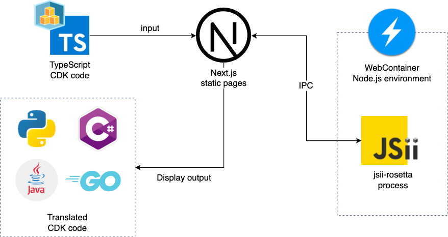

# AWS CDK Translator
Translate TypeScript CDK code to Python, Java, C#, or Go. Powered by [jsii-rosetta](https://github.com/aws/jsii-rosetta).


## Architecture
We run `jsii-rosetta` inside your browser environment, using [WebContainers](https://webcontainers.io/) technology. 



## Run locally

First, create `components/translator/files.json`.

```bash
cd backend
npm ci
npm run copy
```

Then, you can run the development server:

```bash
npm run dev
```

Open [http://localhost:3000](http://localhost:3000) with your browser to see the result.

You can start editing the page by modifying `app/page.tsx`. The page auto-updates as you edit the file.

## Disclaimer
This is my personal project and does not represent any organizations I belong to. 
I don't guarantee anything about the output of this tool. Use it at your own risk.
